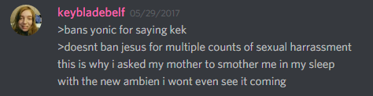
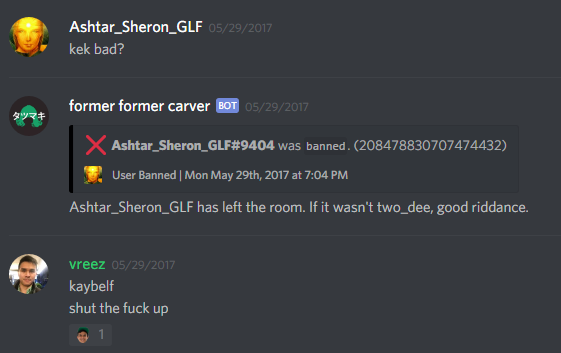
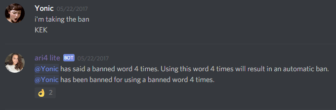
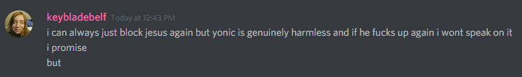

Description:
============

On the 15th of every month, a semiformal ban review is
conducted. This allows members of chat to vote for user bans to be
revoked.

Summary of Ban Review:
======================

Jesus – Unbanned

Yonic – Unbanned

Case \#1 – Jesus
================

Ban Reason:
-----------

By user request, multiple cases of sexual harassment.

Date of Ban:
------------

05/29/2017

Days spent Banned:
------------------

17

Ban Review Discourse:
---------------------

Ruling:
-------

Jesus has been unbanned, because he is generally funny to keep around,
and he does tend to behave better for a few weeks after being unbanned.
We do fully anticipate that he will eventually be banned again.

Case \#2 – Yonic
================

Ban Reason:
-----------

Automatic ban by ari4 for saying kek 4 times

Date of Ban: 
-------------

05/22/2017

Days spent Banned:
------------------

24

Ban Review Discourse:
---------------------

Ruling:
-------

Yonic has been unbanned. While he does 4chan meme too much, he is well
liked by certain users. The “kek” check was indeed specifically targeted
at him and some felt that the rule was unfair in the first place.

A caveat is that the “kek” check will remain in place. 200+ in 2 weeks
really is excessive.

Conclusion
==========

Both users were unbanned, we hope that they have learned their lessons.
(Even though we know for sure that Jesus won’t)

We hope that both users will contribute to a more friendly and active
chat.
